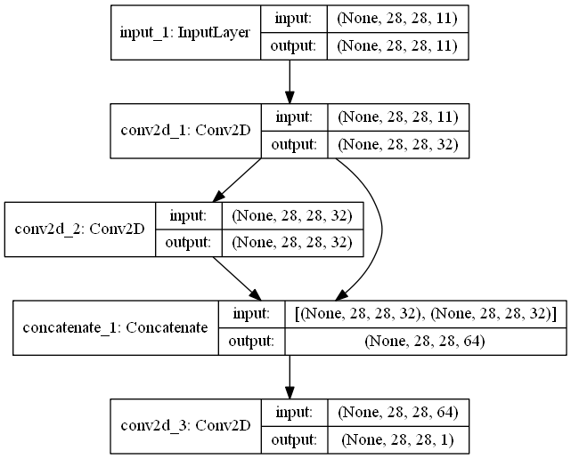
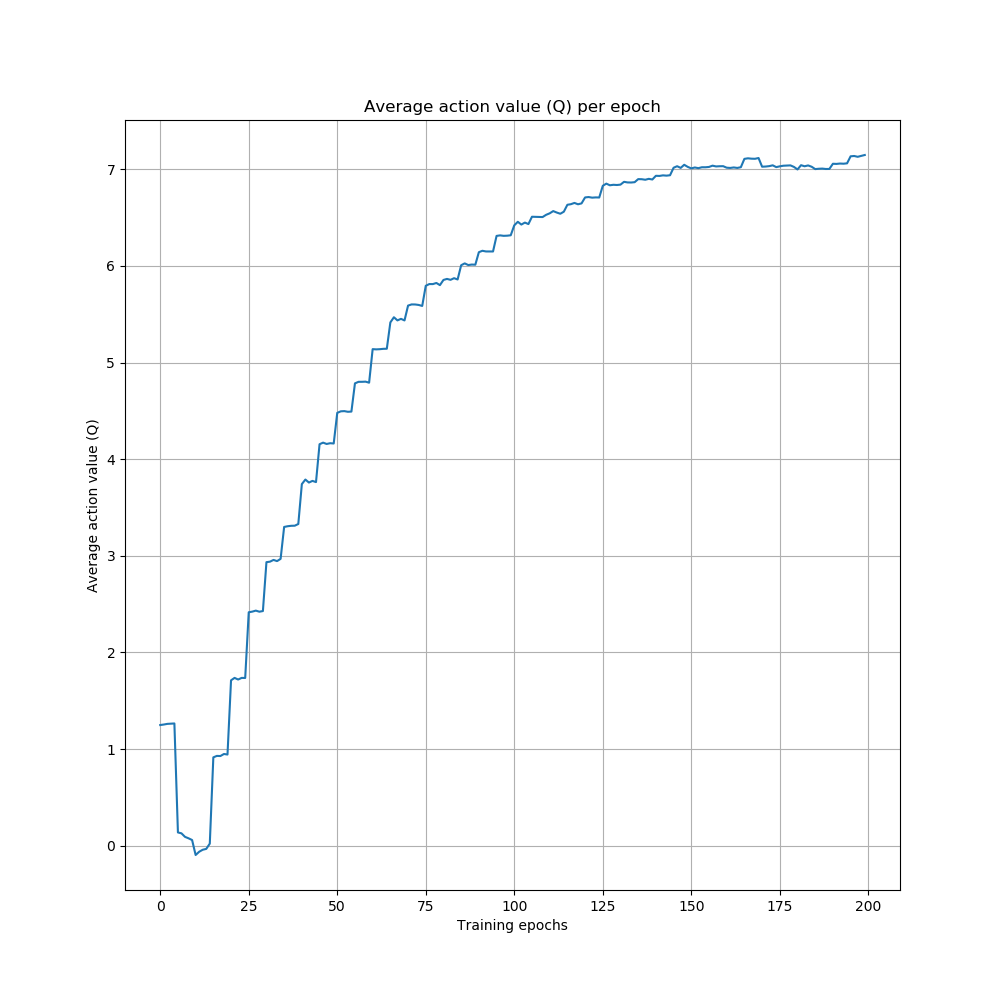
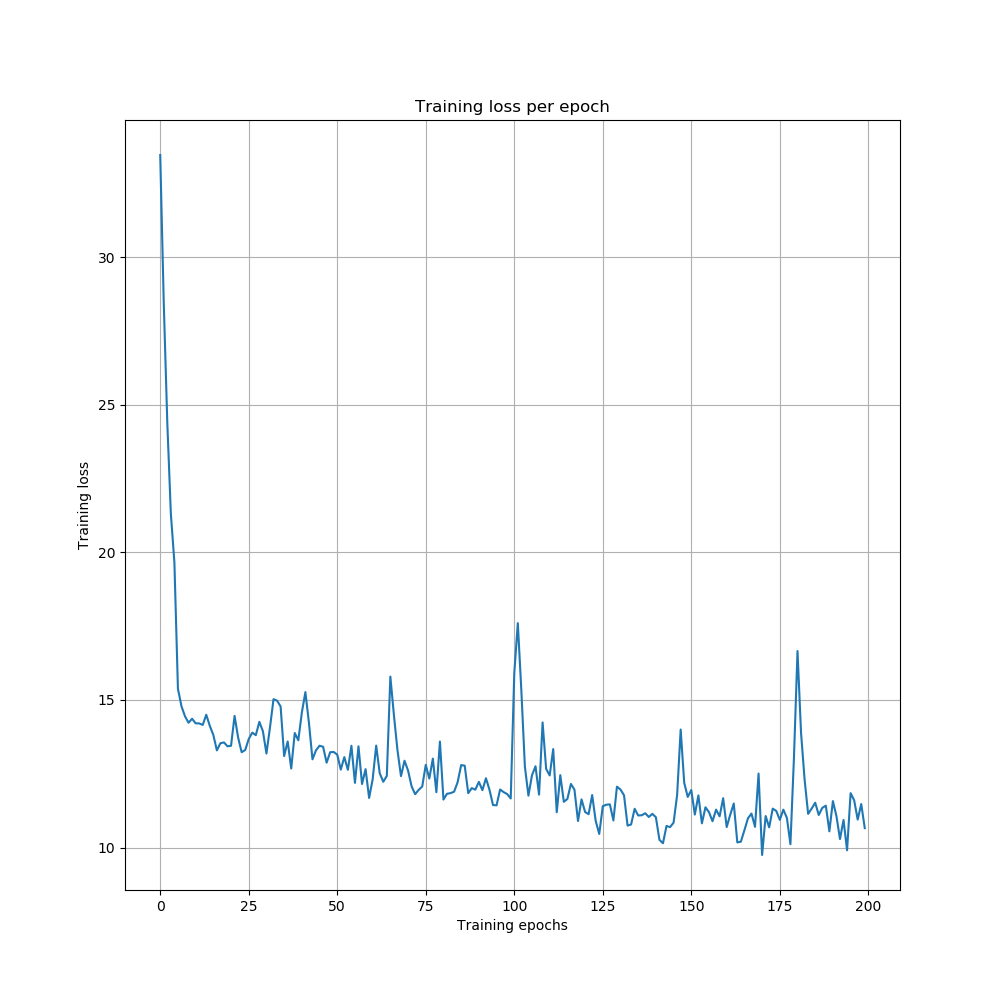
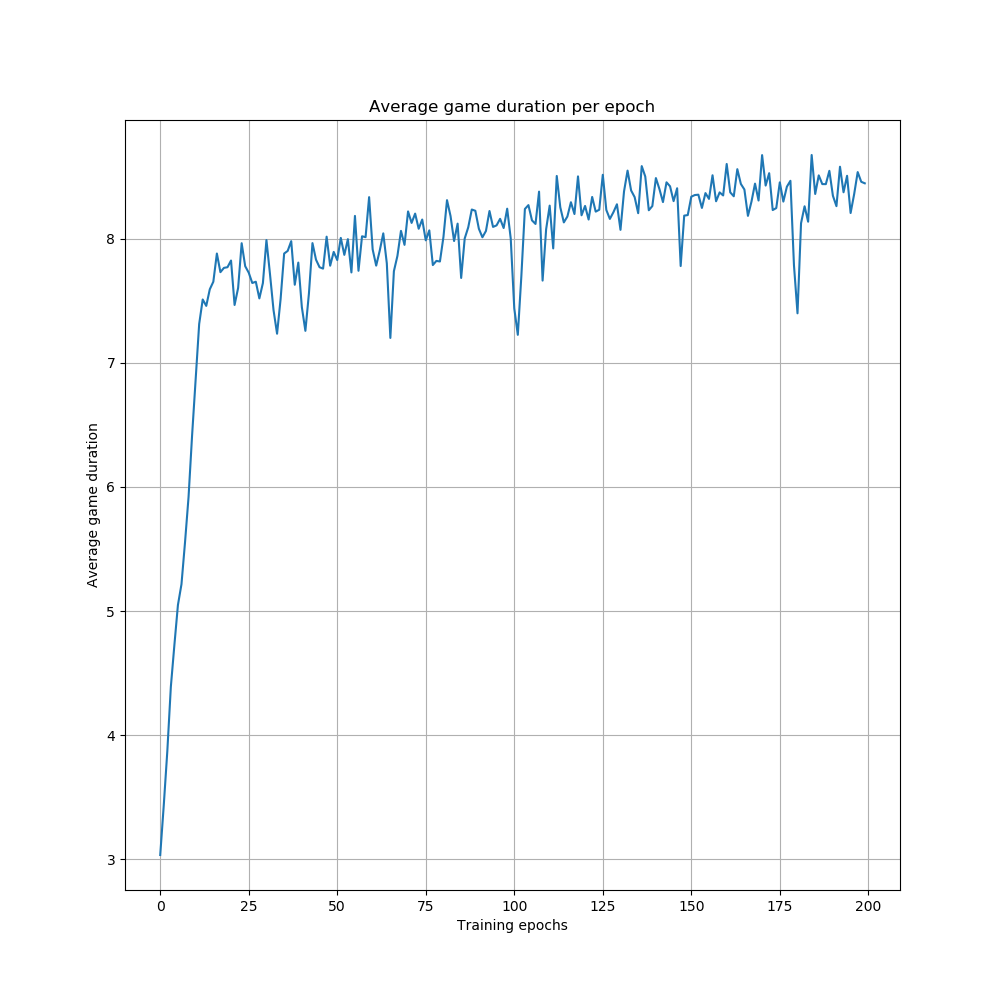
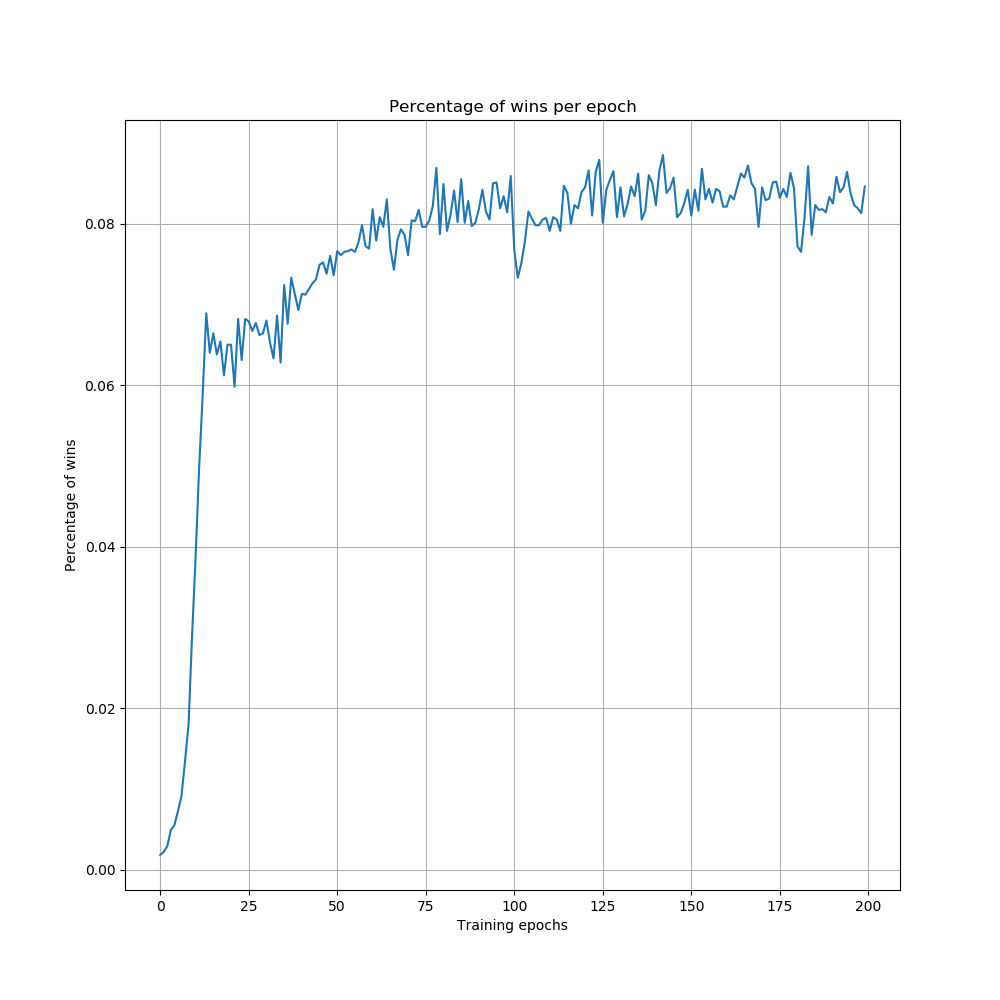
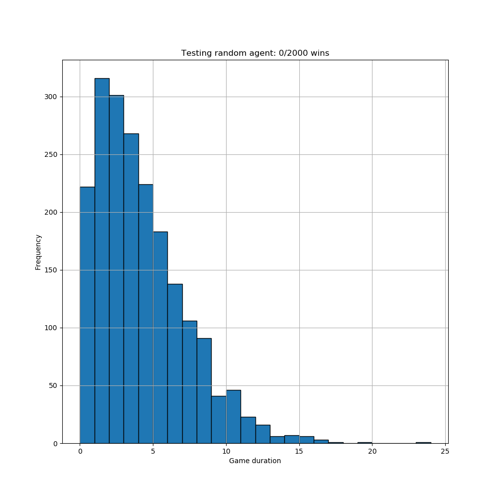
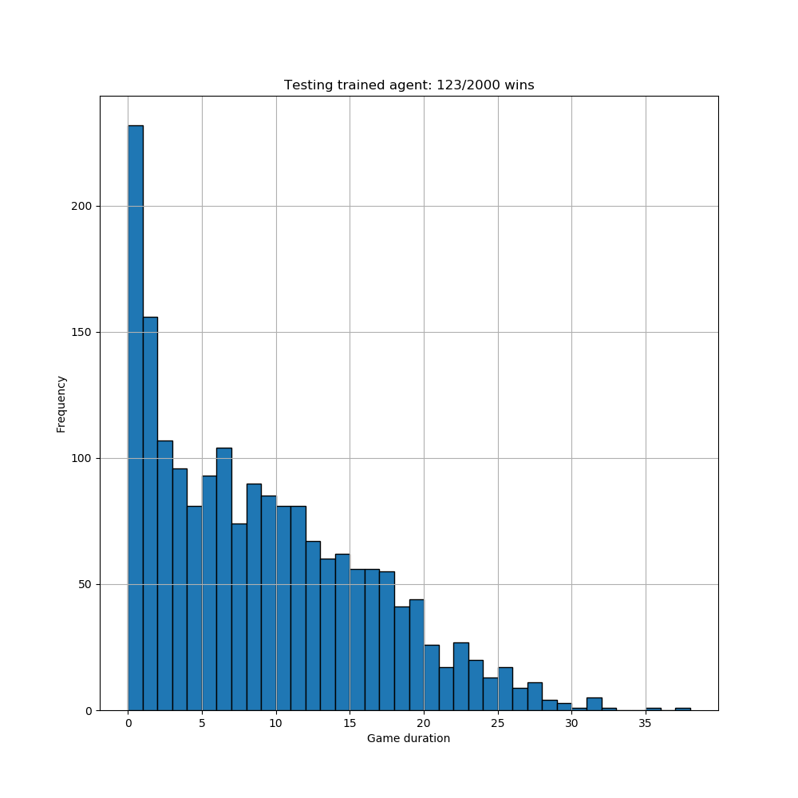
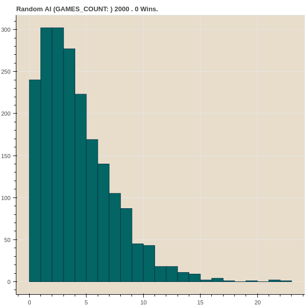
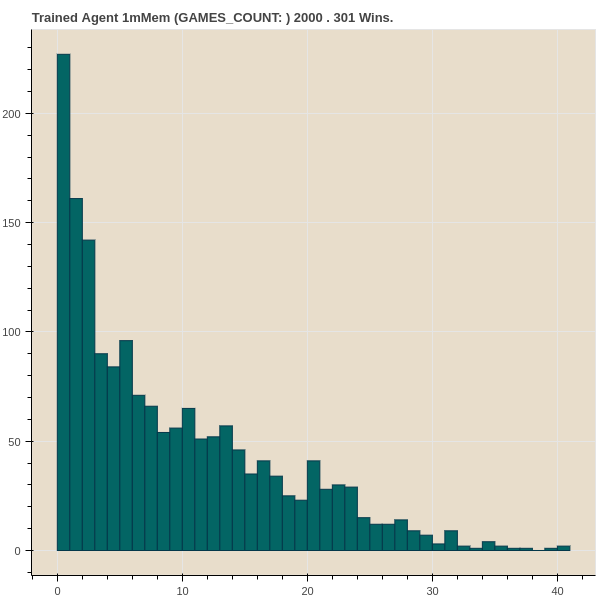

Using Reinforcement Learning to solve Minesweeper
=================================================

This code is based on a fork of https://github.com/HaniAlmousli/minesweeperRLDemo .
The minesweeper code originates from https://github.com/cash/minesweeper .

The main changes from @HaniAlmousli are:

  - In the original implementation, a regressor is trained per action to predict the Q value given a state, and
    at every update, a brand new set of regressors are trained.    
    Instead, we propose to use a regressor with a partial_fit method:
    http://scikit-learn.org/stable/modules/scaling_strategies.html#incremental-learning

 - AgentDQN.py has been added to experiment with the DQN approach using Keras.

 Training Results for DQN agent
 ------------------------------

CNN model:

 

 

The advantage of using a CNN is that the model can be trained on a specific game size but can then be applied to games of any size. 

 Testing results
 ---------------

Random Agent:

 

DQN Agent:

 

 Results from @HaniAlmousli
 --------------------------

Random Agent:

 

Ridge Regressor Agent:

 

 Conclusion
 ----------

 A Linear Model that takes the whole Minesweeper grid as input works better than a dense CNN that only looks at the game with a sliding window (twice better in this case). But the CNN approach has the advantage of being independent of the size of the game (for instance it was trained on a 16x16 grid and tested on a 10x10 grid).
